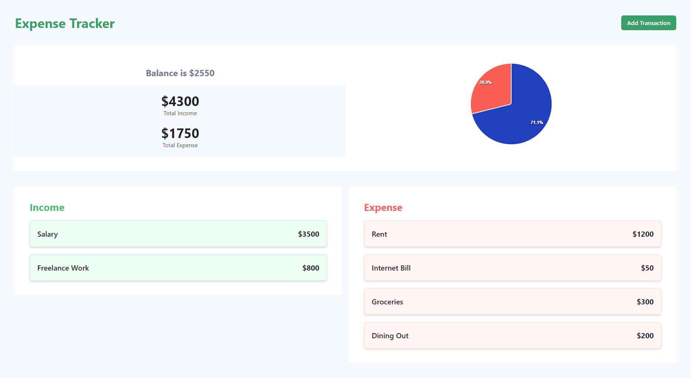

# Expense Tracker - [Visit Now](https://expense-tracker-chakra.netlify.app)

This is a simple Expense Tracker web application built using React.js. It helps users track their expenses conveniently. The project utilizes Chakra UI for styling, react-apexcharts for visualizing data, and the Context API for state management.

## Technologies Used

- React.js
- Chakra UI
- react-apexcharts
- Context API

## Features

- Add new transactions with details like description, amount.
- View a list of all income and expenses along with their details.
- Visualize expense data using interactive charts.

## Screen



## Installation

1. Clone the repository:

   ```bash
   git clone https://github.com/Abhijitkr/expense-tracker.git
   ```

2. Navigate to the directory:

   ```bash
   cd expense-tracker
   ```

3. Install dependencies:

   ```bash
   npm install
   ```

4. Start the deployment server

   ```bash
   npm run dev
   ```

5. Open your browser and visit http://localhost:5173 to view the app.

## Usage

- To add a new expense, click on the "Add Transaction" button and fill in the required details.
- View the Balance with Total Income and Total Expense.
- Visualize expense data by navigating to the Charts page.
- View the list of expenses on the main dashboard.
